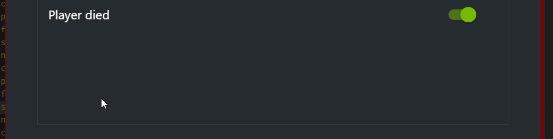

## Developers
[](https://jitpack.io/#1fxe/Highlights)

Add JitPack repository to your pom.xml file:

```xml
<repositories>
    <repository>
        <id>jitpack.io</id>
        <url>https://jitpack.io</url>
    </repository>
</repositories>
```

Add the dependency:

```xml
<dependency>
    <groupId>com.github.1fxe</groupId>
    <artifactId>Highlights</artifactId>
    <version>4d34f57065</version>
</dependency>
```

Include the GfeSDK library from `redistrubute/` folder and the `libMCHighlights.dll` in your java library path.

### Example

See `sample/` folder for a sample project.

Initialize the library:
```java
Highlights highlights = new Highlights();
```

Create some highlights, highlight id STEALTH_KILL will be used to identify the highlight, the significance and type can also be specified:
```java
Highlight highlight = new Highlight("STEALTH_KILL", true,
    NVGSDK_HighlightType.NVGSDK_HIGHLIGHT_TYPE_ACHIEVEMENT, NVGSDK_HighlightSignificance.NVGSDK_HIGHLIGHT_SIGNIFICANCE_GOOD,
    Collections.singletonList(new LocalizedPair("en-us", "Player died"))
);

highlights.init("Sample", Collections.singletonList(highlight));
```



You can then trigger the highlight on specific events, saving 2 seconds clip:
```java
if (key == GLFW_KEY_R && action == GLFW_RELEASE)
    highlight.saveVideo("STEALTH_KILL", "GROUP_ONE", -1000, 1000);
```